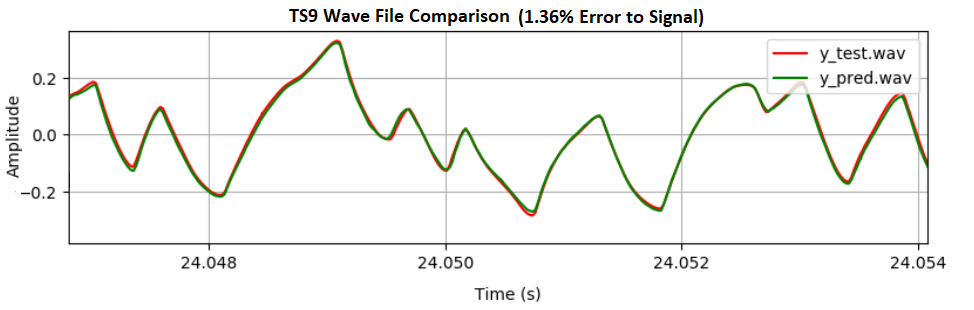

# PedalNetRT

PedalNet-RealTime trains guitar effect/amp neural network models for
use with the SmartGuitarPedal, SmartGuitarAmp, and WaveNetVA plugins.
You can train a model using this repository, then convert it to a .json
model that can be loaded into the VST plugin. Effective for modeling
distortion style effects or tube amplifiers.

Video walkthrough of model training and usage:
https://www.youtube.com/watch?v=xkrqF0D8pfQ

The following repositories are compatible with the converted .json model,
for use with real time guitar playing through a DAW plugin or stand alone app:

SmartGuitarPedal<br>
https://github.com/GuitarML/SmartGuitarPedal<br>

SmartGuitarAmp<br>
https://github.com/GuitarML/SmartGuitarAmp<br>

WaveNetVa<br>
https://github.com/damskaggep/WaveNetVA


Email your best json models to smartguitarml@gmail.com and they may be included
in the next plugin release.

## Info
Re-creation of model from [Real-Time Guitar Amplifier Emulation with Deep
Learning](https://www.mdpi.com/2076-3417/10/3/766/htm)

Notice:
This project is a modified version of the original Pedalnet, from which<br>
the model, data preparation, training, and predition scripts were obtained. 9/25/2020<br>
Please see original PedalNet, without which this project would not be possible:<br>
https://github.com/teddykoker/pedalnet

For a great explanation of how it works, check out blog post from original pedalnet:<br>
http://teddykoker.com/2020/05/deep-learning-for-guitar-effect-emulation/


## Setup

> Jupyter Notebooks for Google Colab are available in [notebooks](notebooks)

1. Install [Python 3](https://www.python.org/downloads/) with pip package manager
2. Install [git](https://git-scm.com/downloads)
3. Create and enter virtual environment
   ```sh
   python -m venv .
   ```

   ```sh
   . bin/activate
   ```
4. Clone the repository
   ```sh
   git clone https://github.com/GuitarML/PedalNetRT.git src/
   ```
5. Enter the directory and install the dependencies using `pip` package manager
   ```sh
   cd src
   ```

   ```sh
   python -m pip install -r requirements.txt
   ```

   (Optional development dependencies)

   ```sh
   python -m pip install -r requirements-dev.txt
   ```

## Data

`data/ts9_test1_in_FP32.wav` - Playing from a Fender Telecaster, bridge pickup, max tone and volume<br>
`data/ts9_test1_out_FP32.wav` - Split with JHS Buffer Splitter to Ibanez TS9 Tube Screamer
(max drive, mid tone and volume).<br>
`models/pedalnet/pedalnet.ckpt` - Pretrained model weights


**Run effect on .wav file**:
Must be single channel, 44.1 kHz, FP32 wav data (not int16)
```bash
python train.py data/ts9_test1_in_FP32.wav data/ts9_test1_out_FP32.wav

# specify input file and desired output file
python predict.py my_input_guitar.wav my_output.wav

# if you trained your own model you can pass --model flag
# with path to .ckpt
# For example:
--model=models/your_model_name/your_model_name.ckpt
```

**Train**:
```bash
python train.py data/ts9_test1_in_FP32.wav data/ts9_test1_out_FP32.wav

# When training your own model add this flag:
--model=models/your_model_name/your_model_name.ckpt

python train.py --resume  # to resume training

python train.py --gpus "0,1"  # for multiple gpus
python train.py --cpu # for cpu training
python train.py -h # help (see for other hyperparameters)


# The data preparation is included in train.py, but you can run prepare.py separately before training if desired:
python prepare.py data/ts9_test1_in_FP32.wav data/ts9_test1_out_FP32.wav --model=models/your_model_name/your_model_name.ckpt
```

**Test**:
```bash
python test.py # test pretrained model
python test.py --model=your_trained_model.ckpt  # test trained model
```
Creates files `y_test.wav`, `y_pred.wav`, and `x_test.wav`, for the ground truth
output, predicted output, and input signal respectively.


**Model Conversion**:

The .ckpt model must be converted to a .json model to run in the plugin.
Usage:

	python export.py --model=your_trained_model.ckpt

Generates a file named "converted_model.json" that can be loaded into the VST plugin.

**Analysis**:

You can also use "plot.py" to evaluate the trained PedalNet model. By
default, this will analyze the three .wav files from the test.py output. It
will output analysis plots and calculate the error to signal ratio.

Usage (after running "python test.py --model=your_trained_model.ckpt"):

	python plot.py



Public spreadsheet for sharing analysis results (can request write access through google account):<br>
https://docs.google.com/spreadsheets/d/1sIkhW3cdLkMc8bYrYspE8xzdCrJbyWXg_I0vAuJec88/edit?usp=sharing

## Training Info
Differences from the original PedalNet (to make compatible with WaveNet plugin):
1. Uses a custom Causal Padding mode not available in PyTorch.
2. Uses a single conv1d layer for both sigm and tanh calculations, instead of
   two separate layers.
3. Adds a conv1d input layer.
4. Requires float32 .wav files for training (instead of int16).

Helpful tips on training models:
1. Wav files should be 3 - 4 minutes long, and contain a variety of
   chords, individual notes, and playing techniques to get a full spectrum
   of data for the model to "learn" from.
2. A buffer splitter was used with pedals to obtain a pure guitar signal
   and post effect signal.
3. Obtaining sample data from an amp can be done by splitting off the original
   signal, with the post amp signal coming from a microphone (I used a SM57).
   Keep in mind that this captures the dynamic response of the mic and cabinet.
   In the original research the sound was captured directly from within the amp
   circuit to have a "pure" amp signal.
4. Generally speaking, the more distorted the effect/amp, the more difficult it
   is to train. Experiment with different hyperparameters for each target
   hardware. I found that a model with only 5 channels was able to sufficiently
   model some effects, and this reduces the model size and allows the plugin
   to use less processing power.
5. When recording samples, try to maximize the volume levels without clipping.
   The levels you train the model at will be reproduced by the plugin. Also try
   to make the pre effect and post effect wav samples equal in volume levels.
   Even though the actual amp or effect may raise the level significantly, this isn't
   necessarily desirable in the end plugin.
6. This WaveNet model is effective at reproducing distortion/overdrive, but
   not reverb/delay effects (or other time-based effects). Mostly untested on
   compressor/limiter effects, but initial results seem promising.
